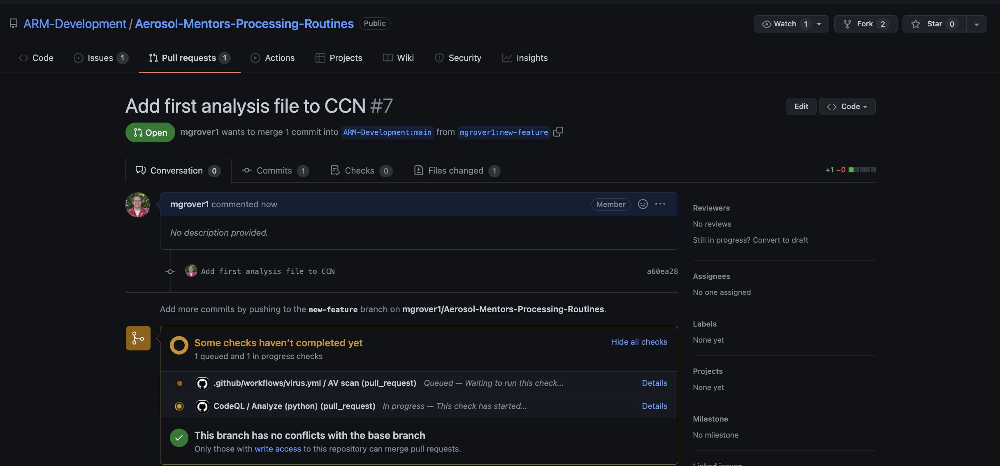

# Contributing Using Branches and Pull Requests

## Overview:

1. What is a Pull Request (PR)?
1. Forking + Branch Workflow
1. Creating a Branch and Making Changes
1. Submit Your First Pull Request

## Prerequisites

| Concepts                                      | Importance  | Notes |
| --------------------------------------------- | ----------- | ----- |
| [Introduction to Github](introduction)        | Necessary   |       |
| [Cloning and Forking a Repo](forking_cloning)  | Necessary  |       |

- **Time to learn**: 30 minutes

## What is a Pull Request?

A Pull Request (PR) is a formal mechanism for requesting that changes
that you have made to one repository are integrated (merged) into
another repository. Typically, the changes are reviewed by the
maintainers of the destination repository, potentially triggering
a cycle of revisions, before the PR is “merged”, and your changes
become part of the destination repo.

Just like issues, PRs have
their own discussion forum for communicating about the proposed
changes. In fact, not only can maintainers or collaborators communicate
about your PR via GitHub, they can also suggest changes and may
even be able to make changes of their own by pushing follow-up
commits. All of the activity, from start to finish, is tracked
inside of the PR and can be reviewed at any time.

When a contributor to a project creates a PR they are requesting
that the owners of another destination repository pull a git
branch from the contributor’s repository and merge the contents of
the branch into a branch of the destination repository. This means
that the contributor must provide four pieces of information: the
contributor’s repository, the contributor’s branch, the destination
repository, and finally, the destination branch.

After the maintainers or collaborators of the destination review
the changes, and any suggested revisions are made, the project
maintainer merges the feature into the destination repository and
closes the PR.

## Forking & Branch Workflow

A typical sequence of steps consists of the following:

1. A contributor _forks_ the upstream repository, creating a remote clone that is owned by the contributor (as you did in the previous section)
1. The contributor then clones the newly created personal remote repository, creating a local copy. (We did this in the previous section)
1. The contributor creates a new branch in their local repository
1. The contributor makes changes to the branch and commits them to their local repository
1. The contributor pushes the branch to their personal remote repository that was created in step 1
1. The contributor submits a PR via GitHub to the upstream repository

### What's a Branch?

Git branches allow for non-linear or differing revision histories of a repository. At a point in time, you can split your repository into multiple development paths (branches) where you can make different commits in each, typically with the ultimate intention of merging these branches and development changes together at a later time.

Branching is one of git's methods for helping with collaborative document editing, much like "change tracking" in Google Docs or Microsoft Word. It enables multiple people to edit copies of the same document content, while reducing or managing edit collisions, and with the ultimate aim of merging everyones changes together later. It also allows the same person to edit multiple copies of the same document, but with different intentions. Some reasons for wanting to split your repository into multiple paths (i.e. branches) is to experiment with different methods of solving a problem (before deciding which method will ultimately be merged) and to work on different problems within the same codebase (without confusing which code changes are relevant to which problem). There are also some convenience bots on GitHub that, if installed in the repository, may not act as intended if your work is all on the `main` branch.

These branches can live on your computer (local) or on GitHub (remote). They are brought together through Git _pushes_, _pulls_, and _pull requests_. _Pushing_ is how you transfer changes from your local repository to a remote repository. _Pulling_ is how you fetch upstream changes into your branch. And _Pull Requests_ are how you suggest the changes you've made on your branch to the upstream codebase.

One rule of thumb is for each development feature to have its own development branch until that feature is ready to be added to the upstream (remote) codebase. This allows you to compartmentalize your pull requests so that smaller working changes can be merged upstream independently of one another. For example, you might have a complete or near-complete feature on its own branch with an open pull request awaiting review. While you wait for feedback from the team before merging it, you can still work on a second feature on a second branch without affecting your first feature's pull request. **We encourage you to always do your work in a designated branch.**

## Creating Your First Branch

Let's start by going into that repository you cloned!

```
cd Aerosol-Mentors-Processing-Routines
```

Let's checkout which branch we are on!

```
git branch

* main
```

### Creating our New Branch - `new-feature`

We are currently on the `main` branchm which is the default. Since we want to add a new feature, we need to create a new branch! Let's all it `new-feature`!

```
git checkout -b new-feature
```

This command will create a new branch named `new-feature`, if it
doesn’t exist already, or switch to the existing branch if it does.
Either way, any changes you make will occur in the branch `new-feature`,
not in `main`. The output should look something like:

```
Switched to a new branch 'new-feature'
```

### Making Changes on our New Branch

Next, we'll make changes and commit them to the `my-new-feature branch` in
the local git repository.

#### Create a Sample File

Let's create a sample file  (`analysis.txt`) in the `CCN/Python/` directory!

Feel free to use your favorite editor fo this!

```
This is an overview of my analysis
```

You'll notice after making that change, if we use the command

```
git status
```

We see

```
On branch new-feature
Untracked files:
  (use "git add <file>..." to include in what will be committed)
	CCN/Python/analysis.txt
```

We need to add this new file to be tracked by Github!

#### Commit Your Changes
Since you made changes to your local copy of the repository, you will need to add and commit those changes! You can do this using the following:

```
git add CCN/Python/analysis.txt
git commit -m "Add first analysis file to CCN"
```

You'll see your terminal return something similar to:

```
1 file changed, 1 insertion(+)
 create mode 100644 CCN/Python/analysis.txt
```

### Push Your Branch to Github

After running `git commit` your changes have been captured in your
local repository. But most likely only you can see them, and if
your local file system fails your changes may be lost. To make your
changes visible to others, and safely stored on your remote GitHub
repository, you need to push them. Here is the `push` command that we expect to fail:

```
git push
fatal: The current branch new-feature has no upstream branch.
To push the current branch and set the remote as upstream, use
    git push --set-upstream origin new-feature
```

This failed because our copy online does not have our new branch yet! We need to use the following to add our new branch to our non-Local, online copy of the repository!

```
git push --set-upstream origin new-feature
```

This now returns:

```
Enumerating objects: 8, done.
Counting objects: 100% (8/8), done.
Delta compression using up to 12 threads
Compressing objects: 100% (4/4), done.
Writing objects: 100% (5/5), 438 bytes | 438.00 KiB/s, done.
Total 5 (delta 2), reused 0 (delta 0)
remote: Resolving deltas: 100% (2/2), completed with 2 local objects.
remote: 
remote: Create a pull request for 'new-feature' on GitHub by visiting:
remote:      https://github.com/mgrover1/Aerosol-Mentors-Processing-Routines/pull/new/new-feature
remote: 
To https://github.com/mgrover1/Aerosol-Mentors-Processing-Routines.git
 * [new branch]      new-feature -> new-feature
Branch 'new-feature' set up to track remote branch 'new-feature' from 'origin'.
```

If we follow that last URL, you will see our new branch!


## Submitting a Pull Request

You'll notice at the top of the previous image, in the yellow at the top of the page, is a green bar stating:


Selecting this button will take us to a new page where we can submit our changes to the main repository (https://github.com/ARM-Development/Aerosol-Mentors-Processing-Routines)


At this point, feel free to add any additional details to the changes you are requesting and hit that `Create Pull Request` button near the bottom!

That will submit your Pull Request (PR), and you will see a screen similar to this:



Now, you can wait for people to review your changes, and eventually merge those into the `main` branch!

### Making Sure Branches Are in Sync
It is good practice to make sure that your branches are in sync! For example, if you had a different project (for example `CO`) you wanted to make changes to, you would not want to include those changes from `CCN` as well!

Fortunately, Github makes this easy! From **_your fork of the repository_**, you will see a "Fetch upstream" dropdown!


It is important to do this **early and often** and be sure that when you make changes, you follow the process of:

1. Fetch Upstream Changes on your fork (using the process previously described)
1.  Move to your `main` branch
    ```
    git checkout main
    ```
1.  Use `git pull` to retrieve any changes to `main`
    ```
    git pull
    ```
* Create your new branch!
    ```
    git checkout -b new_branch_name
    ```

#### Syncing Your Branch Programatically

If you are comfortable with the command line interface, you can also complete the first step ("Fetch Upstream Changes on your fork") using the following:

1. Access the "upstream" copy (from ARM-Development)
    ```
    git remote add upstream https://github.com/ARM-Development/Aerosol-Mentors-Processing-Routines.git
    ```
1. Fetch the upstream changes
    ```
    git fetch upstream
    ```
1. Merge your upstream changes with your local changes
    ```
    git merge upstream/main
    ```
1. Push your changes to Github
    ```
    git push
    ```

---

## Summary
* A Pull Request (PR) is a formal mechanism for requesting that changes that you have made to one repository are integrated (merged) into another repository.
* You can create a branch, make changes, and push those changes to Github, then submit a PR with those changes
* It is important to keep your fork in-sync with the upstream repository!

### What's Next?
Submitting your code to the [Aerosol-Mentors-Processing-Routines
 Repository](https://github.com/ARM-Development/Aerosol-Mentors-Processing-Routines)!


