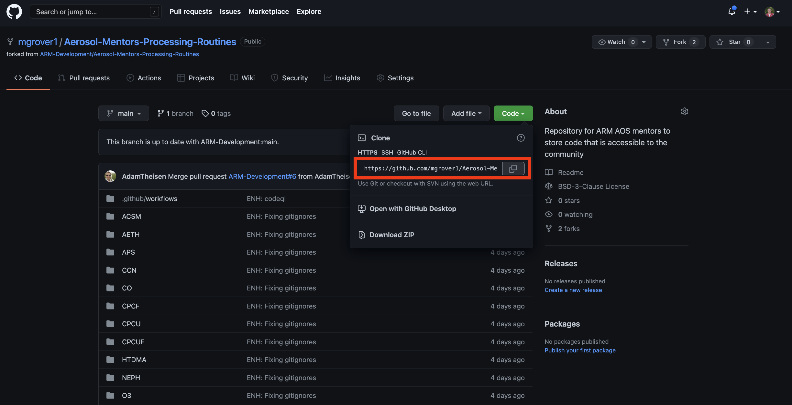

# Cloning and Forking a Repository

## Overview:

1. Forking a repository
1. Cloning a repository

## Prerequisites

| Concepts              | Importance | Notes                        |
| --------------------- | ---------- | ---------------------------- |
| GitHub Introduction   | Necessary  | GitHub user account required |
| Command-line shell    | Helpful    |                              |

- **Time to learn**: 30 minutes

---

## Forking a repository

Forking is essentially _making a copy_ of a Github Repo! Scenarios where forking a repo is indicated include the following:

1. You wish to collaborate on projects that are hosted on GitHub, but you are not one of that project's _maintainers_ (i.e., you do not have _write permissions_ on it).
1. You wish to experiment with changing or adding new features to a project, and do not immediately intend to _merge_ them into the original project's repo (aka, the _base_ repository).

In a fork, you first create a copy of an existing repository, but store it in your own personal GitHub organization (recall that when you create a GitHub account, the _organization_ name is your GitHub user ID).

Let's say we intend to make some changes to the [Aerosol-Mentors-Processing-Routines Repo](https://github.com/ARM-Development/Aerosol-Mentors-Processing-Routines) repo, that ultimately we'll submit to the original repository as a _Pull request_.

```{note}
Be sure you have logged into GitHub at this time!
```

Notice at the top right of the screen, there is a _Fork_ button:


---

Click on it! You should see your GitHub user id (if you administer any other GitHub organizations, you will see them as well). Click on your user id to complete the _fork_. 


---

After a few seconds, your browser will be redirected to the forked repo, now residing in your personal GitHub organization!

Notice that the _Fork_ button on the upper right has incremented by one, and there is also is a line relating your fork to the original repo:


You now have a copy (essentially a clone) of the forked repository, which is now owned by you.

You could, at this point, select one of the files in the repository and use GitHub's built-in editor to make changes to these text-based files. But the typical use case that leverages the collaborative power of GitHub and its command-line cousin, _git_, involves _cloning_ your _forked_ copy of the repo to your local computer, where you can then perform your edits, and (in the case of software) test them on your system.

---

## Cloning a Repository

Now, open up a terminal on your local computer, and if desired, `cd` into a directory that you'd like to house whatever repos you clone. Type `git clone`, and then paste in the URL that you copied from GitHub (i.e., the **origin**):



Then within your termainal, run:

```bash
git clone <url>
```

In my case, that would look like:

```bash
git clone https://github.com/mgrover1/Aerosol-Mentors-Processing-Routines.git
```

**Make sure you use _your_ fork of the repository here!**

You'll see something like the following:

```
Cloning into 'Aerosol-Mentors-Processing-Routines'...
remote: Enumerating objects: 47, done.
remote: Counting objects: 100% (47/47), done.
remote: Compressing objects: 100% (33/33), done.
remote: Total 47 (delta 12), reused 33 (delta 6), pack-reused 0
Unpacking objects: 100% (47/47), done.
```

```{admonition} Windows users
:class: info
While `git` is typically part of a Linux or Mac OS command-line shell, similar functionality must be installed if you are running Windows. Download and install the [Git for Windows](https://gitforwindows.org/) package. This should have been completed within the Introduction.
```

Now, you can `cd` into the `Aerosol-Mentors-Processing-Routines` directory which has been created and populated with the exact contents of the **origin**'s repository at the time you cloned it.

For example,

```
cd Aerosol-Mentors-Processing-Routines
```

We can investigate what it is in here by calling `ls`, or the Windows equivalent!

```
ls

ACSM		APS		CO		CPCU		HTDMA		NEPH		OPC		README.md	SO2		UHSAS
AETH		CCN		CPCF		CPCUF		LICENSE		O3		PSAP		SMPS		SP2
```

By virtue of cloning the repo, _git_ automatically sets the URL of the **origin**'s repository on GitHub. You can show this by typing the following:

```
git remote -v
```

You should see:

```
origin	https://github.com/<username>/Aerosol-Mentors-Processing-Routines.git (fetch)
origin	https://github.com/<username>/Aerosol-Mentors-Processing-Routines.git (push)
```

```{tip}
This link points to where the repository "lives" on GitHub. We will use the term **origin** to refer to this location.
```

**Congratulations!!** You have now forked and cloned a GitHub repository!

---

## Summary
- _Forking_ a repository also makes a copy of a GitHub repo, but places it in your GitHub organization.
- The process of making a copy of a GitHub repository is called _cloning_.
- Forking allows you to modify a repo, without affecting the original version.

## Things to try

- Clone another GitHub-hosted repository that is of interest to you.
- Then try creating a fork of that repository.

### What's Next?

In the next lesson, you will make changes to your _fork_ of a repository, and submit a _pull request_ with the changes!

## References

1. [Cloning vs Forking (GitHub Support)](https://github.community/t/the-difference-between-forking-and-cloning-a-repository/10189)
1. [What the Fork?(GitHub Community)](https://github.community/t/what-the-fork/10187)